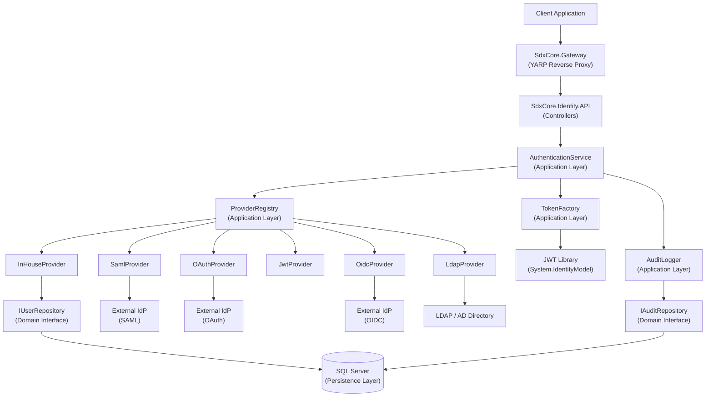
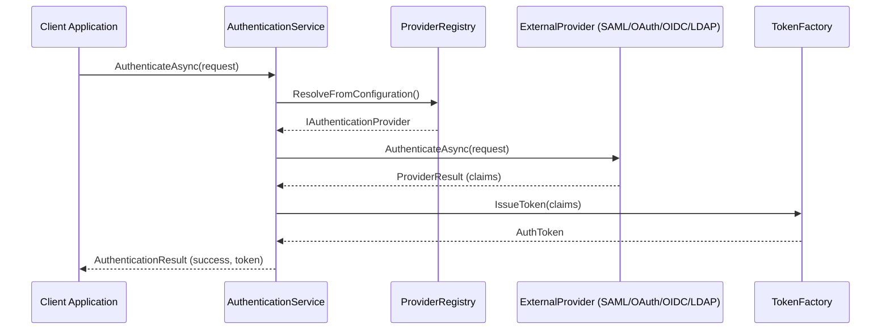
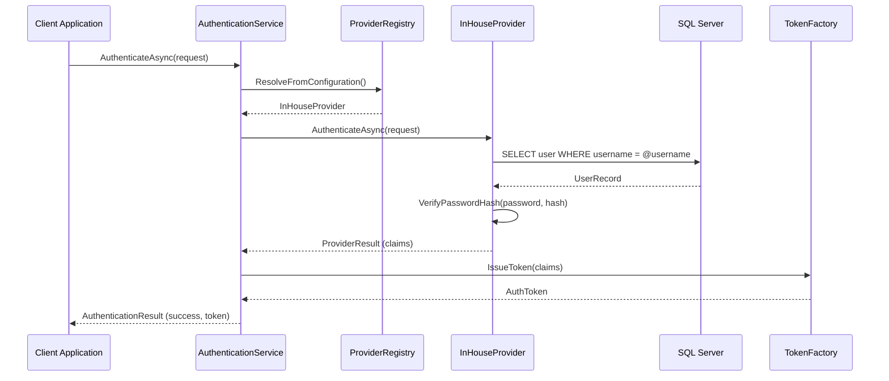
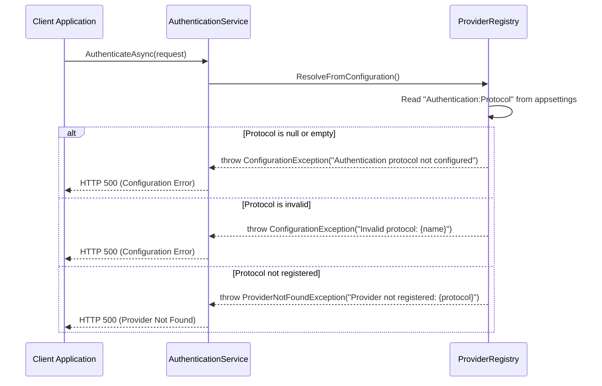

# Design Document: Authentication Module

## Overview

This document describes an independent, pluggable authentication module for a C# .NET Core application backed by SQL Server. The module is designed as a self-contained library that handles user verification exclusively — it does not manage authorization, roles, or permissions. It supports five authentication protocols (SAML 2.0, OAuth 2.0, OpenID Connect, JWT, and LDAP) through a unified provider abstraction, integrates seamlessly with a client's existing identity system.

The solution includes **SdxCore.Gateway**, a YARP-based reverse proxy that serves as the entry point for all client requests, routing them to the appropriate downstream services including the Identity API.

The module follows **SOLID principles** and **Clean Architecture** patterns, organized into five distinct projects:
- **SdxCore.Gateway**: YARP reverse proxy serving as the API gateway (entry point for all requests)
- **SdxCore.Identity.API**: Web API layer exposing authentication endpoints
- **SdxCore.Identity.Application**: Application services and business logic orchestration
- **SdxCore.Identity.Domain**: Domain entities, interfaces, and business rules
- **SdxCore.Identity.Persistence**: Data access layer with Entity Framework Core and SQL Server

The module is protocol-agnostic at its core: all protocol-specific logic is encapsulated in dedicated provider implementations behind a common `IAuthenticationProvider` interface. A central `AuthenticationService` resolves the correct provider at runtime based on the protocol name configured in appsettings.json, ensuring that the consuming application never needs to know which protocol is in use.

**Configuration is mandatory and environment-specific**: 
- The authentication protocol MUST be explicitly configured in appsettings.json
- All configuration values (connection strings, provider settings, etc.) are read from appsettings.json sections
- Environment-specific configurations (Development, Production) override base settings
- If no protocol is configured or the configuration is invalid, the system will throw a `ConfigurationException` rather than falling back to a default provider
- This ensures explicit intent and prevents unintended authentication behavior

---

## Project Structure

The solution follows Clean Architecture principles with clear separation of concerns and includes a YARP-based reverse proxy gateway:

```
SdxCore.Authentication/
├── SdxCore.Gateway/                   # YARP Reverse Proxy (Entry Point)
├── SdxCore.Identity.API/              # Web API Layer (Controllers, Middleware)
├── SdxCore.Identity.Application/      # Application Services, DTOs, Interfaces
├── SdxCore.Identity.Domain/           # Domain Entities, Value Objects, Interfaces
└── SdxCore.Identity.Persistence/      # EF Core, Repositories, Migrations
```

### Request Flow
```
Client → SdxCore.Gateway (YARP) → SdxCore.Identity.API → Application → Domain
                                                                          ↑
                                                                     Persistence
```

### Dependency Flow (SOLID - Dependency Inversion Principle)
```
Gateway (independent) → Identity.API → Application → Domain ← Persistence
```
- **Gateway** is independent, routes requests to downstream services
- **API** depends on Application
- **Application** depends on Domain (interfaces only)
- **Persistence** depends on Domain (implements interfaces)
- **Domain** has no dependencies (pure business logic)

---

## Architecture



---

## Sequence Diagrams

### External Provider Authentication Flow



### In-House Provider Authentication Flow



### Configuration Error Flow



---

## Components and Interfaces

### Component 1: AuthenticationService

**Purpose**: Central orchestrator. Resolves the correct provider, delegates authentication, issues tokens, and records audit events. (Single Responsibility Principle - orchestration only)

**Location**: `SdxCore.Identity.Application/Services/AuthenticationService.cs`

**Interface** (defined in Domain layer):
```csharp
// SdxCore.Identity.Domain/Interfaces/IAuthenticationService.cs
public interface IAuthenticationService
{
    Task<AuthenticationResult> AuthenticateAsync(AuthenticationRequest request, CancellationToken ct = default);
    Task<bool> ValidateTokenAsync(string token, CancellationToken ct = default);
    Task RevokeTokenAsync(string token, CancellationToken ct = default);
}
```

**Responsibilities**:
- Accept authentication requests from the consuming application
- Delegate to `IProviderRegistry` for provider resolution (Dependency Inversion Principle)
- Invoke the resolved provider's `AuthenticateAsync`
- Call `ITokenFactory` to issue a signed JWT on success (Dependency Inversion Principle)
- Write audit log entries via `IAuditLogger` for all authentication attempts (Dependency Inversion Principle)
- Handle configuration errors and propagate them appropriately

---

### Component 2: ProviderRegistry

**Purpose**: Maintains the map of registered providers and resolves the correct one per request. **No fallback behavior** — configuration is mandatory.

**Location**: `SdxCore.Identity.Application/Services/ProviderRegistry.cs`

**Interface**:
```csharp
public interface IProviderRegistry
{
    void Register(AuthProtocol protocol, IAuthenticationProvider provider);
    IAuthenticationProvider Resolve(AuthProtocol protocol);
    IAuthenticationProvider ResolveFromConfiguration();
}
```

**Responsibilities**:
- Hold a dictionary of `AuthProtocol → IAuthenticationProvider` (Single Responsibility Principle)
- Read the protocol name from appsettings.json and return the corresponding provider
- **Throw `ConfigurationException`** when no protocol is configured in appsettings.json
- **Throw `ConfigurationException`** when the configured protocol name is invalid
- **Throw `ProviderNotFoundException`** when the configured protocol is not registered
- Never return null or fall back to a default provider

---

### Component 3: IAuthenticationProvider

**Purpose**: Common contract implemented by all protocol-specific providers. (Open/Closed Principle - open for extension via new providers, closed for modification)

**Location**: `SdxCore.Identity.Domain/Interfaces/IAuthenticationProvider.cs`

**Interface**:
```csharp
// SdxCore.Identity.Domain/Interfaces/IAuthenticationProvider.cs
public interface IAuthenticationProvider
{
    AuthProtocol Protocol { get; }
    Task<ProviderResult> AuthenticateAsync(AuthenticationRequest request, CancellationToken ct = default);
}
```

**Implementations** (all in `SdxCore.Identity.Application/Providers/`):
| Class | Protocol | Location |
|---|---|---|
| `SamlProvider` | SAML 2.0 | `Application/Providers/SamlProvider.cs` |
| `OAuthProvider` | OAuth 2.0 | `Application/Providers/OAuthProvider.cs` |
| `OidcProvider` | OpenID Connect | `Application/Providers/OidcProvider.cs` |
| `JwtProvider` | JWT (token validation) | `Application/Providers/JwtProvider.cs` |
| `LdapProvider` | LDAP / Active Directory | `Application/Providers/LdapProvider.cs` |
| `InHouseProvider` | Built-in credential store | `Application/Providers/InHouseProvider.cs` |

---

### Component 4: InHouseProvider

**Purpose**: Provider backed by SQL Server. Handles username/password authentication when "InHouse" is explicitly configured in appsettings.json. (Liskov Substitution Principle - can be substituted for any IAuthenticationProvider)

**Location**: `SdxCore.Identity.Application/Providers/InHouseProvider.cs`

**Interface**:
```csharp
// SdxCore.Identity.Domain/Interfaces/IInHouseProvider.cs
public interface IInHouseProvider : IAuthenticationProvider
{
    Task<UserRecord> CreateUserAsync(CreateUserRequest request, CancellationToken ct = default);
    Task<bool> ChangePasswordAsync(ChangePasswordRequest request, CancellationToken ct = default);
    Task<bool> DeactivateUserAsync(string userId, CancellationToken ct = default);
}
```

**Responsibilities**:
- Query SQL Server via `IUserRepository` for the user record by username (Dependency Inversion Principle)
- Verify the submitted password against the stored Argon2id hash via `IPasswordHasher` (Dependency Inversion Principle)
- Return a `ProviderResult` with standard claims on success
- Lock accounts after configurable failed attempt threshold

---

### Component 5: TokenFactory

**Purpose**: Issues and validates signed JWT tokens. (Single Responsibility Principle - token operations only)

**Location**: `SdxCore.Identity.Application/Services/TokenFactory.cs`

**Interface** (defined in Domain layer):
```csharp
// SdxCore.Identity.Domain/Interfaces/ITokenFactory.cs
public interface ITokenFactory
{
    AuthToken IssueToken(IEnumerable<Claim> claims);
    ClaimsPrincipal? ValidateToken(string token);
    void RevokeToken(string token);
}
```

**Responsibilities**:
- Sign JWTs using RS256 (asymmetric) or HS256 (symmetric) based on configuration
- Embed standard claims: `sub`, `iat`, `exp`, `jti`
- Maintain an in-memory (or Redis-backed) revocation list keyed by `jti`

---

### Component 6: AuditLogger

**Purpose**: Records all authentication events to SQL Server for compliance and diagnostics. (Single Responsibility Principle - audit logging only)

**Location**: `SdxCore.Identity.Application/Services/AuditLogger.cs`

**Interface** (defined in Domain layer):
```csharp
// SdxCore.Identity.Domain/Interfaces/IAuditLogger.cs
public interface IAuditLogger
{
    Task LogAsync(AuditEvent auditEvent, CancellationToken ct = default);
}
```

**Implementation**: Uses `IAuditRepository` from Domain layer (Dependency Inversion Principle)

---

## Data Models

### AuthenticationRequest

```csharp
public sealed record AuthenticationRequest
{
    public required string? Username { get; init; }
    public required string? Password { get; init; }
    public string? SamlAssertion { get; init; }
    public string? OAuthCode { get; init; }
    public string? IdToken { get; init; }
    public string? BearerToken { get; init; }
    public IDictionary<string, string> ExtraParameters { get; init; } = new Dictionary<string, string>();
}
```

**Validation Rules**:
- Protocol is determined from appsettings.json configuration, not from the request
- For `InHouse`: `Username` and `Password` must be non-null and non-empty
- For `SAML`: `SamlAssertion` must be non-null
- For `OAuth`: `OAuthCode` must be non-null
- For `OIDC`: `IdToken` must be non-null
- For `JWT`: `BearerToken` must be non-null

---

### AuthenticationResult

```csharp
public sealed record AuthenticationResult
{
    public required bool IsSuccess { get; init; }
    public AuthToken? Token { get; init; }
    public string? ErrorCode { get; init; }
    public string? ErrorMessage { get; init; }
    public IReadOnlyList<Claim> Claims { get; init; } = [];
}
```

---

### AuthToken

```csharp
public sealed record AuthToken
{
    public required string AccessToken { get; init; }
    public required DateTimeOffset ExpiresAt { get; init; }
    public string? RefreshToken { get; init; }
    public required string TokenType { get; init; } = "Bearer";
}
```

---

### ProviderResult

```csharp
public sealed record ProviderResult
{
    public required bool IsSuccess { get; init; }
    public IReadOnlyList<Claim> Claims { get; init; } = [];
    public string? FailureReason { get; init; }
}
```

---

### UserRecord (Domain Entity)

**Location**: `SdxCore.Identity.Domain/Entities/UserRecord.cs`

```csharp
// SdxCore.Identity.Domain/Entities/UserRecord.cs
public sealed class UserRecord
{
    public Guid Id { get; set; }
    public required string Username { get; set; }
    public required string PasswordHash { get; set; }       // Argon2id
    public required string Email { get; set; }
    public bool IsActive { get; set; } = true;
    public int FailedAttempts { get; set; } = 0;
    public DateTimeOffset? LockedUntil { get; set; }
    public DateTimeOffset CreatedAt { get; set; }
    public DateTimeOffset? LastLoginAt { get; set; }
}
```

**Database Mapping**: Configured in `SdxCore.Identity.Persistence/Configurations/UserRecordConfiguration.cs` using EF Core Fluent API

---

### AuditEvent (Domain Entity)

**Location**: `SdxCore.Identity.Domain/Entities/AuditEvent.cs`

```csharp
// SdxCore.Identity.Domain/Entities/AuditEvent.cs
public sealed record AuditEvent
{
    public required string EventType { get; init; }         // "LOGIN_SUCCESS", "LOGIN_FAILURE", etc.
    public required AuthProtocol Protocol { get; init; }
    public string? UserId { get; init; }
    public string? Username { get; init; }
    public required string IpAddress { get; init; }
    public required DateTimeOffset OccurredAt { get; init; }
    public string? FailureReason { get; init; }
}
```

**Database Mapping**: Configured in `SdxCore.Identity.Persistence/Configurations/AuditEventConfiguration.cs` using EF Core Fluent API

---

### AuthProtocol (Domain Enum)

**Location**: `SdxCore.Identity.Domain/Enums/AuthProtocol.cs`

```csharp
// SdxCore.Identity.Domain/Enums/AuthProtocol.cs
public enum AuthProtocol
{
    InHouse,
    Saml,
    OAuth,
    Oidc,
    Jwt,
    Ldap
}
```

---

## Algorithmic Pseudocode

### Main Authentication Algorithm

```csharp
// ALGORITHM: AuthenticationService.AuthenticateAsync
// INPUT:  AuthenticationRequest request
// OUTPUT: AuthenticationResult
// PRECONDITIONS:
//   - request is not null
//   - ProviderRegistry is initialized with at least InHouseProvider
// POSTCONDITIONS:
//   - Returns AuthenticationResult with IsSuccess = true and a valid Token on success
//   - Returns AuthenticationResult with IsSuccess = false and ErrorCode on failure
//   - An AuditEvent is always written regardless of outcome

public async Task<AuthenticationResult> AuthenticateAsync(AuthenticationRequest request, CancellationToken ct)
{
    // 1. Validate request shape
    if (request is null)
        throw new ArgumentNullException(nameof(request));

    // 2. Resolve provider from appsettings.json configuration
    IAuthenticationProvider provider = _registry.ResolveFromConfiguration();

    // 3. Delegate to provider
    ProviderResult providerResult = await provider.AuthenticateAsync(request, ct);

    // 4. On failure: audit and return
    if (!providerResult.IsSuccess)
    {
        await _auditLogger.LogAsync(BuildAuditEvent("LOGIN_FAILURE", provider.Protocol, request, providerResult.FailureReason), ct);
        return new AuthenticationResult { IsSuccess = false, ErrorCode = "AUTH_FAILED", ErrorMessage = providerResult.FailureReason };
    }

    // 5. Issue token from claims
    AuthToken token = _tokenFactory.IssueToken(providerResult.Claims);

    // 6. Audit success
    await _auditLogger.LogAsync(BuildAuditEvent("LOGIN_SUCCESS", provider.Protocol, request, null), ct);

    // 7. Return result
    return new AuthenticationResult { IsSuccess = true, Token = token, Claims = providerResult.Claims };
}
// LOOP INVARIANTS: N/A (no loops in this algorithm)
```

---

### InHouse Provider Authentication Algorithm

```csharp
// ALGORITHM: InHouseProvider.AuthenticateAsync
// INPUT:  AuthenticationRequest request (Username, Password required)
// OUTPUT: ProviderResult
// PRECONDITIONS:
//   - request.Username is non-null and non-empty
//   - request.Password is non-null and non-empty
//   - SQL Server connection is available
// POSTCONDITIONS:
//   - Returns ProviderResult.IsSuccess = true with claims if credentials are valid and account is active
//   - Returns ProviderResult.IsSuccess = false with FailureReason otherwise
//   - FailedAttempts is incremented on each failed attempt
//   - Account is locked when FailedAttempts >= MaxFailedAttempts

public async Task<ProviderResult> AuthenticateAsync(AuthenticationRequest request, CancellationToken ct)
{
    // 1. Validate inputs
    if (string.IsNullOrWhiteSpace(request.Username) || string.IsNullOrWhiteSpace(request.Password))
        return Fail("Username and password are required.");

    // 2. Load user from SQL Server
    UserRecord? user = await _userRepository.FindByUsernameAsync(request.Username, ct);
    if (user is null)
        return Fail("Invalid credentials.");          // Do not reveal whether user exists

    // 3. Check account status
    if (!user.IsActive)
        return Fail("Account is inactive.");

    if (user.LockedUntil.HasValue && user.LockedUntil > DateTimeOffset.UtcNow)
        return Fail("Account is temporarily locked.");

    // 4. Verify password hash (Argon2id)
    bool passwordValid = _passwordHasher.Verify(request.Password, user.PasswordHash);

    if (!passwordValid)
    {
        // Increment failed attempts; lock if threshold reached
        await _userRepository.IncrementFailedAttemptsAsync(user.Id, ct);
        return Fail("Invalid credentials.");
    }

    // 5. Reset failed attempts on success
    await _userRepository.ResetFailedAttemptsAsync(user.Id, ct);
    await _userRepository.UpdateLastLoginAsync(user.Id, DateTimeOffset.UtcNow, ct);

    // 6. Build claims
    IReadOnlyList<Claim> claims = BuildClaims(user);

    return new ProviderResult { IsSuccess = true, Claims = claims };
}
// LOOP INVARIANTS: N/A
```

---

### Provider Registry Resolution Algorithm

```csharp
// ALGORITHM: ProviderRegistry.ResolveFromConfiguration
// INPUT:  None (reads from IConfiguration)
// OUTPUT: IAuthenticationProvider
// PRECONDITIONS:
//   - IConfiguration is injected and available
//   - At least one provider is registered
// POSTCONDITIONS:
//   - Returns the registered provider for the configured protocol name
//   - Throws ConfigurationException when no protocol is configured
//   - Throws ConfigurationException when the configured protocol name is invalid
//   - Throws ProviderNotFoundException when the configured protocol is not registered
//   - Never returns null

public IAuthenticationProvider ResolveFromConfiguration()
{
    // 1. Read protocol name from appsettings.json
    string? protocolName = _configuration["Authentication:Protocol"];

    // 2. No protocol configured → throw exception (mandatory configuration)
    if (string.IsNullOrWhiteSpace(protocolName))
    {
        _logger.LogError("Authentication protocol is not configured in appsettings.json. Please set 'Authentication:Protocol' to one of: InHouse, Saml, OAuth, Oidc, Jwt, Ldap");
        throw new ConfigurationException("Authentication protocol is not configured in appsettings.json. Please set 'Authentication:Protocol' to one of: InHouse, Saml, OAuth, Oidc, Jwt, Ldap");
    }

    // 3. Parse protocol name to enum
    if (!Enum.TryParse<AuthProtocol>(protocolName, ignoreCase: true, out AuthProtocol protocol))
    {
        _logger.LogError("Invalid protocol name '{ProtocolName}' in configuration. Valid values are: InHouse, Saml, OAuth, Oidc, Jwt, Ldap", protocolName);
        throw new ConfigurationException($"Invalid protocol name '{protocolName}' in configuration. Valid values are: InHouse, Saml, OAuth, Oidc, Jwt, Ldap");
    }

    // 4. Protocol specified and registered → return it
    if (_providers.TryGetValue(protocol, out IAuthenticationProvider? provider))
        return provider;

    // 5. Protocol specified but not registered → throw exception
    _logger.LogError("Provider for protocol '{Protocol}' is not registered. Please register the provider using the appropriate extension method (e.g., AddInHouseProvider, AddSamlProvider).", protocol);
    throw new ProviderNotFoundException($"Provider for protocol '{protocol}' is not registered. Please register the provider using the appropriate extension method.");
}
// LOOP INVARIANTS: N/A
```

---

### Token Issuance Algorithm

```csharp
// ALGORITHM: TokenFactory.IssueToken
// INPUT:  IEnumerable<Claim> claims
// OUTPUT: AuthToken
// PRECONDITIONS:
//   - claims is non-null and non-empty
//   - Signing key is configured
// POSTCONDITIONS:
//   - Returns a signed JWT with exp = now + TokenLifetime
//   - Token contains all provided claims plus standard claims (sub, iat, exp, jti)
//   - jti is a unique GUID per token

public AuthToken IssueToken(IEnumerable<Claim> claims)
{
    var now = DateTimeOffset.UtcNow;
    var expiry = now.Add(_options.TokenLifetime);
    var jti = Guid.NewGuid().ToString();

    var allClaims = claims
        .Append(new Claim(JwtRegisteredClaimNames.Jti, jti))
        .Append(new Claim(JwtRegisteredClaimNames.Iat, now.ToUnixTimeSeconds().ToString()));

    var descriptor = new SecurityTokenDescriptor
    {
        Subject = new ClaimsIdentity(allClaims),
        Expires = expiry.UtcDateTime,
        Issuer = _options.Issuer,
        Audience = _options.Audience,
        SigningCredentials = _signingCredentials
    };

    var handler = new JwtSecurityTokenHandler();
    string accessToken = handler.WriteToken(handler.CreateToken(descriptor));

    return new AuthToken
    {
        AccessToken = accessToken,
        ExpiresAt = expiry,
        TokenType = "Bearer"
    };
}
// LOOP INVARIANTS: N/A
```

---

## Key Functions with Formal Specifications

### AuthenticationService.ValidateTokenAsync

```csharp
Task<bool> ValidateTokenAsync(string token, CancellationToken ct = default)
```

**Preconditions**:
- `token` is non-null and non-empty string
- `TokenFactory` signing key is configured

**Postconditions**:
- Returns `true` if and only if the token is cryptographically valid, not expired, and not revoked
- Returns `false` for any invalid, expired, or revoked token
- No side effects on the token store

---

### InHouseProvider.CreateUserAsync

```csharp
Task<UserRecord> CreateUserAsync(CreateUserRequest request, CancellationToken ct = default)
```

**Preconditions**:
- `request.Username` is non-null, non-empty, and unique in the database
- `request.Password` meets the configured complexity policy
- `request.Email` is a valid email address

**Postconditions**:
- A new `UserRecord` is persisted to SQL Server with `IsActive = true` and `FailedAttempts = 0`
- `PasswordHash` stores the Argon2id hash of the submitted password — the plaintext is never stored
- Returns the created `UserRecord` with a newly assigned `Id`

---

### LdapProvider.AuthenticateAsync

```csharp
Task<ProviderResult> AuthenticateAsync(AuthenticationRequest request, CancellationToken ct = default)
```

**Preconditions**:
- `request.Username` and `request.Password` are non-null and non-empty
- LDAP server connection string and base DN are configured

**Postconditions**:
- Performs a bind operation against the LDAP directory
- Returns `ProviderResult.IsSuccess = true` with user claims if bind succeeds
- Returns `ProviderResult.IsSuccess = false` if bind fails or user is not found
- LDAP connection is always closed/disposed after the operation

---

## Example Usage

### Gateway Configuration (SdxCore.Gateway)

#### Program.cs
```csharp
// SdxCore.Gateway/Program.cs
var builder = WebApplication.CreateBuilder(args);

// Add YARP reverse proxy
builder.Services.AddReverseProxy()
    .LoadFromConfig(builder.Configuration.GetSection("ReverseProxy"));

var app = builder.Build();

// Map reverse proxy routes
app.MapReverseProxy();

app.Run();
```

#### appsettings.json
```json
{
  "Logging": {
    "LogLevel": {
      "Default": "Information",
      "Microsoft.AspNetCore": "Warning",
      "Yarp": "Information"
    }
  },
  "AllowedHosts": "*",
  "ReverseProxy": {
    "Routes": {
      "identity-route": {
        "ClusterId": "identity-cluster",
        "Match": {
          "Path": "/api/auth/{**catch-all}"
        }
      }
    },
    "Clusters": {
      "identity-cluster": {
        "Destinations": {
          "identity-api": {
            "Address": "https://localhost:5001"
          }
        }
      }
    }
  }
}
```

#### appsettings.Development.json
```json
{
  "ReverseProxy": {
    "Clusters": {
      "identity-cluster": {
        "Destinations": {
          "identity-api": {
            "Address": "http://localhost:5001"
          }
        }
      }
    }
  }
}
```

#### appsettings.Production.json
```json
{
  "ReverseProxy": {
    "Clusters": {
      "identity-cluster": {
        "Destinations": {
          "identity-api": {
            "Address": "https://identity-api.production.com"
          }
        }
      }
    }
  }
}
```

---

### Identity API Configuration (SdxCore.Identity.API)

#### Program.cs
```csharp
// SdxCore.Identity.API/Program.cs
var builder = WebApplication.CreateBuilder(args);

// Add controllers
builder.Services.AddControllers();

// Register the authentication module via DI extension
// All configuration values come from appsettings.json
builder.Services.AddSdxCoreAuthentication(builder.Configuration);

// Register the persistence layer (EF Core + SQL Server)
// Connection string comes from appsettings.json
builder.Services.AddSdxCorePersistence(builder.Configuration);

// Register providers based on what you need
// IMPORTANT: You must register the provider that matches your appsettings.json "Authentication:Protocol" value
var protocol = builder.Configuration["Authentication:Protocol"];
switch (protocol?.ToLowerInvariant())
{
    case "inhouse":
        builder.Services.AddInHouseProvider();
        break;
    case "saml":
        builder.Services.AddSamlProvider(builder.Configuration);
        break;
    case "oauth":
        builder.Services.AddOAuthProvider(builder.Configuration);
        break;
    case "oidc":
        builder.Services.AddOidcProvider(builder.Configuration);
        break;
    case "jwt":
        builder.Services.AddJwtProvider(builder.Configuration);
        break;
    case "ldap":
        builder.Services.AddLdapProvider(builder.Configuration);
        break;
    default:
        throw new InvalidOperationException($"Invalid or missing authentication protocol: {protocol}. Please configure 'Authentication:Protocol' in appsettings.json");
}

var app = builder.Build();

app.UseHttpsRedirection();
app.UseAuthorization();
app.MapControllers();

app.Run();
```

#### appsettings.json
```json
{
  "Logging": {
    "LogLevel": {
      "Default": "Information",
      "Microsoft.AspNetCore": "Warning"
    }
  },
  "AllowedHosts": "*",
  "ConnectionStrings": {
    "DefaultConnection": "Server=localhost;Database=SdxCoreIdentity;Trusted_Connection=True;TrustServerCertificate=True;MultipleActiveResultSets=true"
  },
  "Authentication": {
    "Protocol": "InHouse",
    "Issuer": "https://auth.myapp.com",
    "Audience": "myapp-api",
    "TokenLifetime": "01:00:00",
    "SigningKeyPath": "/run/secrets/auth-signing-key.pem",
    "MaxFailedAttempts": 5,
    "LockoutDuration": "00:15:00"
  },
  "Saml": {
    "MetadataUrl": "https://idp.example.com/metadata",
    "ServiceProviderEntityId": "https://auth.myapp.com/saml"
  },
  "OAuth": {
    "ClientId": "your-client-id",
    "ClientSecret": "your-client-secret",
    "AuthorizationEndpoint": "https://oauth.example.com/authorize",
    "TokenEndpoint": "https://oauth.example.com/token"
  },
  "Oidc": {
    "Authority": "https://login.microsoftonline.com/tenant-id",
    "ClientId": "your-client-id",
    "ClientSecret": "your-client-secret"
  },
  "Ldap": {
    "ServerUrl": "ldaps://corp.example.com:636",
    "BaseDn": "dc=corp,dc=example,dc=com",
    "BindDn": "cn=admin,dc=corp,dc=example,dc=com",
    "BindPassword": "admin-password"
  }
}
```

#### appsettings.Development.json
```json
{
  "ConnectionStrings": {
    "DefaultConnection": "Server=localhost;Database=SdxCoreIdentity_Dev;Trusted_Connection=True;TrustServerCertificate=True;MultipleActiveResultSets=true"
  },
  "Authentication": {
    "Protocol": "InHouse",
    "Issuer": "https://localhost:5001",
    "Audience": "myapp-api-dev",
    "SigningKeyPath": "./dev-signing-key.pem"
  }
}
```

#### appsettings.Production.json
```json
{
  "ConnectionStrings": {
    "DefaultConnection": "Server=prod-sql-server.database.windows.net;Database=SdxCoreIdentity;User Id=sqladmin;Password=${SQL_PASSWORD};Encrypt=True;TrustServerCertificate=False"
  },
  "Authentication": {
    "Protocol": "Saml",
    "Issuer": "https://auth.production.com",
    "Audience": "myapp-api-prod",
    "SigningKeyPath": "/run/secrets/prod-signing-key.pem",
    "MaxFailedAttempts": 3,
    "LockoutDuration": "00:30:00"
  },
  "Saml": {
    "MetadataUrl": "https://idp.production.com/metadata",
    "ServiceProviderEntityId": "https://auth.production.com/saml"
  }
}
```

---

### Authenticating a User (Controller)

```csharp
// SdxCore.Identity.API/Controllers/AuthController.cs
[ApiController]
[Route("api/auth")]
public class AuthController : ControllerBase
{
    private readonly IAuthenticationService _authService;
    private readonly ILogger<AuthController> _logger;

    public AuthController(IAuthenticationService authService, ILogger<AuthController> logger)
    {
        _authService = authService;
        _logger = logger;
    }

    [HttpPost("login")]
    public async Task<IActionResult> Login([FromBody] LoginRequest body, CancellationToken ct)
    {
        try
        {
            var request = new AuthenticationRequest
            {
                Username = body.Username,
                Password = body.Password
            };

            AuthenticationResult result = await _authService.AuthenticateAsync(request, ct);

            if (!result.IsSuccess)
                return Unauthorized(new { result.ErrorCode, result.ErrorMessage });

            return Ok(new { result.Token!.AccessToken, result.Token.ExpiresAt });
        }
        catch (ConfigurationException ex)
        {
            _logger.LogError(ex, "Configuration error during authentication");
            return StatusCode(500, new { ErrorCode = "CONFIGURATION_ERROR", ErrorMessage = "Authentication service is not properly configured" });
        }
        catch (ProviderNotFoundException ex)
        {
            _logger.LogError(ex, "Provider not found during authentication");
            return StatusCode(500, new { ErrorCode = "PROVIDER_NOT_FOUND", ErrorMessage = "Authentication provider is not available" });
        }
    }
}
```

**Client Usage (via Gateway):**
```bash
# Client makes request to Gateway
POST https://gateway.myapp.com/api/auth/login
Content-Type: application/json

{
  "username": "john.doe",
  "password": "SecurePassword123!"
}

# Gateway forwards to Identity API
# POST https://identity-api.internal/api/auth/login
```

---

### Validating a Token (Middleware)

```csharp
// SdxCore.Identity.API/Middleware/TokenValidationMiddleware.cs
public class TokenValidationMiddleware
{
    private readonly RequestDelegate _next;
    private readonly IAuthenticationService _authService;
    private readonly ILogger<TokenValidationMiddleware> _logger;

    public TokenValidationMiddleware(
        RequestDelegate next, 
        IAuthenticationService authService,
        ILogger<TokenValidationMiddleware> logger)
    {
        _next = next;
        _authService = authService;
        _logger = logger;
    }

    public async Task InvokeAsync(HttpContext context)
    {
        string? token = context.Request.Headers.Authorization
            .FirstOrDefault()?.Replace("Bearer ", string.Empty);

        if (token is not null)
        {
            bool valid = await _authService.ValidateTokenAsync(token, context.RequestAborted);
            if (!valid)
            {
                _logger.LogWarning("Invalid token received from {IpAddress}", context.Connection.RemoteIpAddress);
                context.Response.StatusCode = 401;
                await context.Response.WriteAsJsonAsync(new { ErrorCode = "INVALID_TOKEN", ErrorMessage = "Token is invalid, expired, or revoked" });
                return;
            }
        }

        await _next(context);
    }
}
```

---

## Correctness Properties

- For all `AuthenticationRequest r`, if `AuthenticateAsync(r)` returns `IsSuccess = true`, then `result.Token` is non-null and `result.Token.ExpiresAt > DateTimeOffset.UtcNow`.
- For all tokens `t` issued by `TokenFactory.IssueToken`, `ValidateToken(t)` returns a non-null `ClaimsPrincipal` until `t` expires or is revoked.
- For all tokens `t`, after `RevokeTokenAsync(t)` is called, `ValidateTokenAsync(t)` returns `false`.
- For all authentication requests, when the configured protocol in appsettings.json is null or empty, `ResolveFromConfiguration` throws `ConfigurationException` (never returns null or falls back).
- For all authentication requests, when the configured protocol in appsettings.json is invalid, `ResolveFromConfiguration` throws `ConfigurationException`.
- For all authentication requests, when the configured protocol is not registered, `ResolveFromConfiguration` throws `ProviderNotFoundException`.
- For all `UserRecord u` created via `CreateUserAsync`, `u.PasswordHash` never equals the plaintext password submitted in the request.
- For all failed authentication attempts against `InHouseProvider`, `user.FailedAttempts` is monotonically non-decreasing until a successful login resets it.
- For all authentication attempts (success or failure), exactly one `AuditEvent` is written to SQL Server.

---

## Error Handling

### Error Scenario 1: Protocol Not Configured

**Condition**: The "Authentication:Protocol" key is missing, null, or empty in appsettings.json.
**Response**: `ProviderRegistry.ResolveFromConfiguration` logs an error and throws `ConfigurationException` with message: "Authentication protocol is not configured in appsettings.json. Please set 'Authentication:Protocol' to one of: InHouse, Saml, OAuth, Oidc, Jwt, Ldap"
**Recovery**: Administrator must add the "Authentication:Protocol" configuration key with a valid protocol name. Application startup should fail fast to prevent running without proper authentication configuration.

---

### Error Scenario 2: Invalid Protocol Name

**Condition**: The "Authentication:Protocol" value in appsettings.json is not a valid protocol name.
**Response**: `ProviderRegistry.ResolveFromConfiguration` logs an error and throws `ConfigurationException` with message: "Invalid protocol name '{protocolName}' in configuration. Valid values are: InHouse, Saml, OAuth, Oidc, Jwt, Ldap"
**Recovery**: Administrator must correct the protocol name in appsettings.json to match one of the valid enum values.

---

### Error Scenario 3: Provider Not Registered

**Condition**: A valid protocol is specified in appsettings.json but no provider is registered for it in the DI container.
**Response**: `ProviderRegistry.ResolveFromConfiguration` logs an error and throws `ProviderNotFoundException` with message: "Provider for protocol '{protocol}' is not registered. Please register the provider using the appropriate extension method."
**Recovery**: Developer must register the provider in Program.cs using the appropriate extension method (e.g., `AddInHouseProvider()`, `AddSamlProvider()`, etc.).

---

### Error Scenario 4: Invalid Credentials (InHouse)

**Condition**: Username does not exist or password hash does not match.
**Response**: Returns `AuthenticationResult { IsSuccess = false, ErrorCode = "AUTH_FAILED" }`. The error message is deliberately generic to prevent user enumeration.
**Recovery**: Client retries with correct credentials. After `MaxFailedAttempts`, the account is locked for `LockoutDuration`.

---

### Error Scenario 5: Account Locked

**Condition**: `user.LockedUntil > DateTimeOffset.UtcNow`.
**Response**: Returns `AuthenticationResult { IsSuccess = false, ErrorCode = "ACCOUNT_LOCKED" }`.
**Recovery**: Account unlocks automatically after `LockoutDuration`. An admin can also unlock manually.

---

### Error Scenario 6: External IdP Unreachable

**Condition**: Network timeout or HTTP error when contacting SAML/OAuth/OIDC/LDAP endpoint.
**Response**: Provider throws `AuthProviderUnavailableException`. `AuthenticationService` catches it and returns `AuthenticationResult { IsSuccess = false, ErrorCode = "PROVIDER_UNAVAILABLE" }`.
**Recovery**: Client may retry. Administrator should verify external IdP connectivity and configuration.

---

### Error Scenario 7: Token Expired or Revoked

**Condition**: `ValidateTokenAsync` is called with an expired or revoked JWT.
**Response**: Returns `false`. Middleware responds with HTTP 401.
**Recovery**: Client must re-authenticate to obtain a new token.

---

## Testing Strategy

### Unit Testing Approach

Each component is tested in isolation using xUnit and Moq:
- `AuthenticationService`: mock `IProviderRegistry`, `ITokenFactory`, `IAuditLogger`; verify delegation and result mapping.
- `InHouseProvider`: mock `IUserRepository` and `IPasswordHasher`; cover success, wrong password, inactive account, locked account paths.
- `ProviderRegistry`: verify correct provider returned per protocol; verify fallback behavior.
- `TokenFactory`: verify token structure, expiry, claim inclusion, and revocation.

---

### Property-Based Testing Approach

**Property Test Library**: FsCheck (xUnit integration via FsCheck.Xunit)

Key properties to test:
- When appsettings.json has no protocol configured, `ResolveFromConfiguration` throws `ConfigurationException`.
- When appsettings.json has an invalid protocol name, `ResolveFromConfiguration` throws `ConfigurationException`.
- When the configured protocol is not registered, `ResolveFromConfiguration` throws `ProviderNotFoundException`.
- `TokenFactory.IssueToken` followed immediately by `ValidateToken` always returns a valid principal.
- `RevokeToken` followed by `ValidateToken` always returns `false`, for any token.
- `InHouseProvider` never returns `IsSuccess = true` when `Username` or `Password` is null or empty.
- `PasswordHasher.Hash` is deterministically verifiable: `Verify(password, Hash(password))` is always `true`.
- `PasswordHasher.Hash` produces different outputs for the same input (salt randomness).

---

### Integration Testing Approach

Integration tests use `WebApplicationFactory<Program>` with a real SQL Server instance (via Testcontainers.MsSql):
- Full login flow via `POST /api/auth/login` with in-house credentials.
- Token validation middleware rejects requests with expired/revoked tokens.
- Account lockout after N failed attempts.
- SAML/OIDC flows tested against a local mock IdP (e.g., Duende IdentityServer in test mode).

---

## Performance Considerations

- Password hashing (Argon2id) is intentionally slow. Tune memory/iteration parameters to balance security and latency (target: ~200–300ms per hash on the auth server).
- `ProviderRegistry` uses a `ConcurrentDictionary` for lock-free reads in high-concurrency scenarios.
- Token revocation list should be backed by Redis in production to support horizontal scaling; the in-memory default is suitable for single-instance deployments only.
- LDAP connections should be pooled via `LdapConnectionPool` to avoid per-request connection overhead.
- Audit log writes are fire-and-forget (using `Task.Run` with a bounded channel) to avoid adding latency to the authentication critical path.

---

## SOLID Principles Application

- Passwords are hashed with Argon2id (via `Konscious.Security.Cryptography`) — never stored in plaintext or with reversible encryption.
- JWT signing uses RS256 (asymmetric) by default; the private key is loaded from a secrets store (e.g., Azure Key Vault, AWS Secrets Manager, or a mounted secret).
- All error messages for failed authentication are generic to prevent user enumeration attacks.
- SAML assertions are validated for signature, audience, and expiry before trusting claims.
- OAuth/OIDC flows use PKCE and state parameters to prevent CSRF and authorization code interception.
- LDAP connections use LDAPS (TLS) by default; plain LDAP is disabled unless explicitly opted in.
- SQL queries use parameterized statements exclusively (via Entity Framework Core) to prevent SQL injection.
- The `AuditLog` table is append-only; the application user has `INSERT` but not `UPDATE` or `DELETE` on that table.

---

## Dependencies

### SdxCore.Gateway
| Package | Purpose |
|---|---|
| `Yarp.ReverseProxy` | YARP reverse proxy for routing |

### SdxCore.Identity.API
| Package | Purpose |
|---|---|
| `Microsoft.AspNetCore.Authentication.JwtBearer` | JWT middleware integration |

### SdxCore.Identity.Application
| Package | Purpose |
|---|---|
| `System.IdentityModel.Tokens.Jwt` | JWT creation and validation |
| `Konscious.Security.Cryptography.Argon2` | Argon2id password hashing |
| `ITfoxtec.Identity.Saml2` | SAML 2.0 assertion handling |
| `Microsoft.AspNetCore.Authentication.OpenIdConnect` | OIDC protocol support |
| `Novell.Directory.Ldap.NETStandard` | LDAP / Active Directory connectivity |

### SdxCore.Identity.Domain
| Package | Purpose |
|---|---|
| None | Pure domain logic with no external dependencies |

### SdxCore.Identity.Persistence
| Package | Purpose |
|---|---|
| `Microsoft.EntityFrameworkCore.SqlServer` | SQL Server ORM (users, audit log) |
| `Microsoft.EntityFrameworkCore.Design` | EF Core design-time tools for migrations |

### Testing Projects
| Package | Purpose |
|---|---|
| `FsCheck.Xunit` | Property-based testing |
| `Testcontainers.MsSql` | SQL Server integration test containers |
| `Moq` | Unit test mocking |
| `xUnit` | Test framework |
