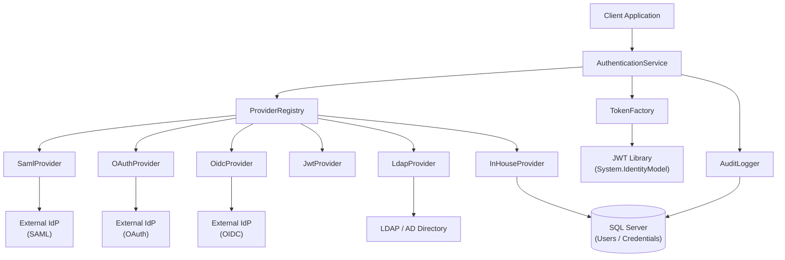
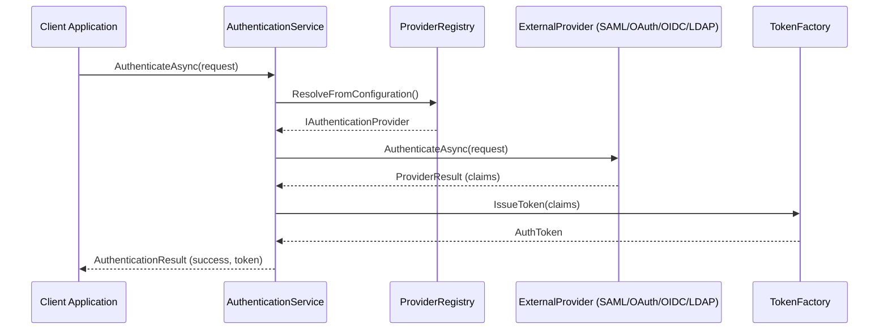
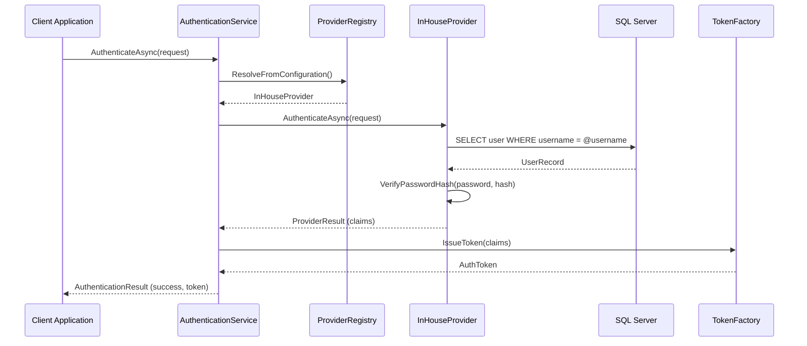
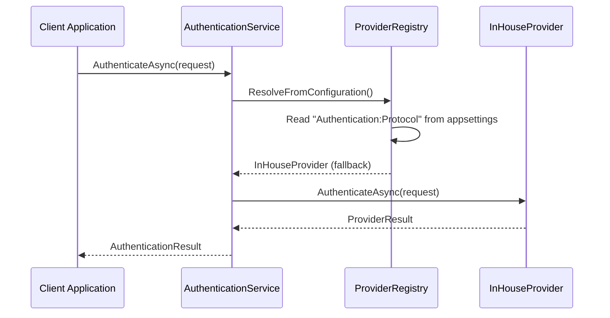

# Design Document: Authentication Module

## Overview

This document describes an independent, pluggable authentication module for a C# .NET Core application backed by SQL Server. The module is designed as a self-contained library that handles user verification exclusively — it does not manage authorization, roles, or permissions. It supports five authentication protocols (SAML 2.0, OAuth 2.0, OpenID Connect, JWT, and LDAP) through a unified provider abstraction, integrates seamlessly with a client's existing identity system, and falls back to a built-in in-house provider when no external identity provider (IdP) is configured.

The module is protocol-agnostic at its core: all protocol-specific logic is encapsulated in dedicated provider implementations behind a common `IAuthenticationProvider` interface. A central `AuthenticationService` resolves the correct provider at runtime based on the protocol name configured in appsettings.json, ensuring that the consuming application never needs to know which protocol is in use.

The in-house provider stores hashed credentials in SQL Server and is the default when no external IdP is registered. It supports standard username/password flows and issues JWT tokens for stateless session management.

---

## Architecture



---

## Sequence Diagrams

### External Provider Authentication Flow



### In-House Provider Authentication Flow



### Fallback Resolution Flow



---

## Components and Interfaces

### Component 1: AuthenticationService

**Purpose**: Central orchestrator. Resolves the correct provider, delegates authentication, issues tokens, and records audit events.

**Interface**:
```csharp
public interface IAuthenticationService
{
    Task<AuthenticationResult> AuthenticateAsync(AuthenticationRequest request, CancellationToken ct = default);
    Task<bool> ValidateTokenAsync(string token, CancellationToken ct = default);
    Task RevokeTokenAsync(string token, CancellationToken ct = default);
}
```

**Responsibilities**:
- Accept authentication requests from the consuming application
- Read the configured protocol name from appsettings.json
- Delegate to `ProviderRegistry` for provider resolution based on the configured protocol
- Invoke the resolved provider's `AuthenticateAsync`
- Call `TokenFactory` to issue a signed JWT on success
- Write audit log entries for all authentication attempts

---

### Component 2: ProviderRegistry

**Purpose**: Maintains the map of registered providers and resolves the correct one per request, with fallback to `InHouseProvider`.

**Interface**:
```csharp
public interface IProviderRegistry
{
    void Register(AuthProtocol protocol, IAuthenticationProvider provider);
    IAuthenticationProvider Resolve(AuthProtocol protocol);
    IAuthenticationProvider ResolveFromConfiguration();
}
```

**Responsibilities**:
- Hold a dictionary of `AuthProtocol → IAuthenticationProvider`
- Return the matching provider or throw `ProviderNotFoundException` if not registered
- Read the protocol name from appsettings.json and return the corresponding provider
- Return `InHouseProvider` when no protocol is configured or no external provider is registered

---

### Component 3: IAuthenticationProvider

**Purpose**: Common contract implemented by all protocol-specific providers.

**Interface**:
```csharp
public interface IAuthenticationProvider
{
    AuthProtocol Protocol { get; }
    Task<ProviderResult> AuthenticateAsync(AuthenticationRequest request, CancellationToken ct = default);
}
```

**Implementations**:
| Class | Protocol |
|---|---|
| `SamlProvider` | SAML 2.0 |
| `OAuthProvider` | OAuth 2.0 |
| `OidcProvider` | OpenID Connect |
| `JwtProvider` | JWT (token validation) |
| `LdapProvider` | LDAP / Active Directory |
| `InHouseProvider` | Built-in credential store |

---

### Component 4: InHouseProvider

**Purpose**: Default provider backed by SQL Server. Handles username/password authentication when no external IdP is configured.

**Interface**:
```csharp
public interface IInHouseProvider : IAuthenticationProvider
{
    Task<UserRecord> CreateUserAsync(CreateUserRequest request, CancellationToken ct = default);
    Task<bool> ChangePasswordAsync(ChangePasswordRequest request, CancellationToken ct = default);
    Task<bool> DeactivateUserAsync(string userId, CancellationToken ct = default);
}
```

**Responsibilities**:
- Query SQL Server for the user record by username
- Verify the submitted password against the stored Argon2id hash
- Return a `ProviderResult` with standard claims on success
- Lock accounts after configurable failed attempt threshold

---

### Component 5: TokenFactory

**Purpose**: Issues and validates signed JWT tokens.

**Interface**:
```csharp
public interface ITokenFactory
{
    AuthToken IssueToken(IEnumerable<Claim> claims);
    ClaimsPrincipal? ValidateToken(string token);
    void RevokeToken(string token);
}
```

**Responsibilities**:
- Sign JWTs using RS256 (asymmetric) or HS256 (symmetric) based on configuration
- Embed standard claims: `sub`, `iat`, `exp`, `jti`
- Maintain an in-memory (or Redis-backed) revocation list keyed by `jti`

---

### Component 6: AuditLogger

**Purpose**: Records all authentication events to SQL Server for compliance and diagnostics.

**Interface**:
```csharp
public interface IAuditLogger
{
    Task LogAsync(AuditEvent auditEvent, CancellationToken ct = default);
}
```

---

## Data Models

### AuthenticationRequest

```csharp
public sealed record AuthenticationRequest
{
    public required string? Username { get; init; }
    public required string? Password { get; init; }
    public string? SamlAssertion { get; init; }
    public string? OAuthCode { get; init; }
    public string? IdToken { get; init; }
    public string? BearerToken { get; init; }
    public IDictionary<string, string> ExtraParameters { get; init; } = new Dictionary<string, string>();
}
```

**Validation Rules**:
- Protocol is determined from appsettings.json configuration, not from the request
- For `InHouse`: `Username` and `Password` must be non-null and non-empty
- For `SAML`: `SamlAssertion` must be non-null
- For `OAuth`: `OAuthCode` must be non-null
- For `OIDC`: `IdToken` must be non-null
- For `JWT`: `BearerToken` must be non-null

---

### AuthenticationResult

```csharp
public sealed record AuthenticationResult
{
    public required bool IsSuccess { get; init; }
    public AuthToken? Token { get; init; }
    public string? ErrorCode { get; init; }
    public string? ErrorMessage { get; init; }
    public IReadOnlyList<Claim> Claims { get; init; } = [];
}
```

---

### AuthToken

```csharp
public sealed record AuthToken
{
    public required string AccessToken { get; init; }
    public required DateTimeOffset ExpiresAt { get; init; }
    public string? RefreshToken { get; init; }
    public required string TokenType { get; init; } = "Bearer";
}
```

---

### ProviderResult

```csharp
public sealed record ProviderResult
{
    public required bool IsSuccess { get; init; }
    public IReadOnlyList<Claim> Claims { get; init; } = [];
    public string? FailureReason { get; init; }
}
```

---

### UserRecord (SQL Server entity)

```csharp
public sealed class UserRecord
{
    public Guid Id { get; set; }
    public required string Username { get; set; }
    public required string PasswordHash { get; set; }       // Argon2id
    public required string Email { get; set; }
    public bool IsActive { get; set; } = true;
    public int FailedAttempts { get; set; } = 0;
    public DateTimeOffset? LockedUntil { get; set; }
    public DateTimeOffset CreatedAt { get; set; }
    public DateTimeOffset? LastLoginAt { get; set; }
}
```

---

### AuditEvent

```csharp
public sealed record AuditEvent
{
    public required string EventType { get; init; }         // "LOGIN_SUCCESS", "LOGIN_FAILURE", etc.
    public required AuthProtocol Protocol { get; init; }
    public string? UserId { get; init; }
    public string? Username { get; init; }
    public required string IpAddress { get; init; }
    public required DateTimeOffset OccurredAt { get; init; }
    public string? FailureReason { get; init; }
}
```

---

### AuthProtocol (enum)

```csharp
public enum AuthProtocol
{
    InHouse,
    Saml,
    OAuth,
    Oidc,
    Jwt,
    Ldap
}
```

---

## Algorithmic Pseudocode

### Main Authentication Algorithm

```csharp
// ALGORITHM: AuthenticationService.AuthenticateAsync
// INPUT:  AuthenticationRequest request
// OUTPUT: AuthenticationResult
// PRECONDITIONS:
//   - request is not null
//   - ProviderRegistry is initialized with at least InHouseProvider
// POSTCONDITIONS:
//   - Returns AuthenticationResult with IsSuccess = true and a valid Token on success
//   - Returns AuthenticationResult with IsSuccess = false and ErrorCode on failure
//   - An AuditEvent is always written regardless of outcome

public async Task<AuthenticationResult> AuthenticateAsync(AuthenticationRequest request, CancellationToken ct)
{
    // 1. Validate request shape
    if (request is null)
        throw new ArgumentNullException(nameof(request));

    // 2. Resolve provider from appsettings.json configuration
    IAuthenticationProvider provider = _registry.ResolveFromConfiguration();

    // 3. Delegate to provider
    ProviderResult providerResult = await provider.AuthenticateAsync(request, ct);

    // 4. On failure: audit and return
    if (!providerResult.IsSuccess)
    {
        await _auditLogger.LogAsync(BuildAuditEvent("LOGIN_FAILURE", provider.Protocol, request, providerResult.FailureReason), ct);
        return new AuthenticationResult { IsSuccess = false, ErrorCode = "AUTH_FAILED", ErrorMessage = providerResult.FailureReason };
    }

    // 5. Issue token from claims
    AuthToken token = _tokenFactory.IssueToken(providerResult.Claims);

    // 6. Audit success
    await _auditLogger.LogAsync(BuildAuditEvent("LOGIN_SUCCESS", provider.Protocol, request, null), ct);

    // 7. Return result
    return new AuthenticationResult { IsSuccess = true, Token = token, Claims = providerResult.Claims };
}
// LOOP INVARIANTS: N/A (no loops in this algorithm)
```

---

### InHouse Provider Authentication Algorithm

```csharp
// ALGORITHM: InHouseProvider.AuthenticateAsync
// INPUT:  AuthenticationRequest request (Username, Password required)
// OUTPUT: ProviderResult
// PRECONDITIONS:
//   - request.Username is non-null and non-empty
//   - request.Password is non-null and non-empty
//   - SQL Server connection is available
// POSTCONDITIONS:
//   - Returns ProviderResult.IsSuccess = true with claims if credentials are valid and account is active
//   - Returns ProviderResult.IsSuccess = false with FailureReason otherwise
//   - FailedAttempts is incremented on each failed attempt
//   - Account is locked when FailedAttempts >= MaxFailedAttempts

public async Task<ProviderResult> AuthenticateAsync(AuthenticationRequest request, CancellationToken ct)
{
    // 1. Validate inputs
    if (string.IsNullOrWhiteSpace(request.Username) || string.IsNullOrWhiteSpace(request.Password))
        return Fail("Username and password are required.");

    // 2. Load user from SQL Server
    UserRecord? user = await _userRepository.FindByUsernameAsync(request.Username, ct);
    if (user is null)
        return Fail("Invalid credentials.");          // Do not reveal whether user exists

    // 3. Check account status
    if (!user.IsActive)
        return Fail("Account is inactive.");

    if (user.LockedUntil.HasValue && user.LockedUntil > DateTimeOffset.UtcNow)
        return Fail("Account is temporarily locked.");

    // 4. Verify password hash (Argon2id)
    bool passwordValid = _passwordHasher.Verify(request.Password, user.PasswordHash);

    if (!passwordValid)
    {
        // Increment failed attempts; lock if threshold reached
        await _userRepository.IncrementFailedAttemptsAsync(user.Id, ct);
        return Fail("Invalid credentials.");
    }

    // 5. Reset failed attempts on success
    await _userRepository.ResetFailedAttemptsAsync(user.Id, ct);
    await _userRepository.UpdateLastLoginAsync(user.Id, DateTimeOffset.UtcNow, ct);

    // 6. Build claims
    IReadOnlyList<Claim> claims = BuildClaims(user);

    return new ProviderResult { IsSuccess = true, Claims = claims };
}
// LOOP INVARIANTS: N/A
```

---

### Provider Registry Resolution Algorithm

```csharp
// ALGORITHM: ProviderRegistry.ResolveFromConfiguration
// INPUT:  None (reads from IConfiguration)
// OUTPUT: IAuthenticationProvider
// PRECONDITIONS:
//   - InHouseProvider is always registered
//   - IConfiguration is injected and available
// POSTCONDITIONS:
//   - Returns the registered provider for the configured protocol name
//   - Returns InHouseProvider when no protocol is configured or not registered
//   - Never returns null

public IAuthenticationProvider ResolveFromConfiguration()
{
    // 1. Read protocol name from appsettings.json
    string? protocolName = _configuration["Authentication:Protocol"];

    // 2. No protocol configured → use InHouse fallback
    if (string.IsNullOrWhiteSpace(protocolName))
        return _providers[AuthProtocol.InHouse];

    // 3. Parse protocol name to enum
    if (!Enum.TryParse<AuthProtocol>(protocolName, ignoreCase: true, out AuthProtocol protocol))
    {
        _logger.LogWarning("Invalid protocol name '{ProtocolName}' in configuration. Falling back to InHouse.", protocolName);
        return _providers[AuthProtocol.InHouse];
    }

    // 4. Protocol specified and registered → return it
    if (_providers.TryGetValue(protocol, out IAuthenticationProvider? provider))
        return provider;

    // 5. Protocol specified but not registered → fallback with warning
    _logger.LogWarning("Provider for {Protocol} not registered. Falling back to InHouse.", protocol);
    return _providers[AuthProtocol.InHouse];
}
// LOOP INVARIANTS: N/A
```

---

### Token Issuance Algorithm

```csharp
// ALGORITHM: TokenFactory.IssueToken
// INPUT:  IEnumerable<Claim> claims
// OUTPUT: AuthToken
// PRECONDITIONS:
//   - claims is non-null and non-empty
//   - Signing key is configured
// POSTCONDITIONS:
//   - Returns a signed JWT with exp = now + TokenLifetime
//   - Token contains all provided claims plus standard claims (sub, iat, exp, jti)
//   - jti is a unique GUID per token

public AuthToken IssueToken(IEnumerable<Claim> claims)
{
    var now = DateTimeOffset.UtcNow;
    var expiry = now.Add(_options.TokenLifetime);
    var jti = Guid.NewGuid().ToString();

    var allClaims = claims
        .Append(new Claim(JwtRegisteredClaimNames.Jti, jti))
        .Append(new Claim(JwtRegisteredClaimNames.Iat, now.ToUnixTimeSeconds().ToString()));

    var descriptor = new SecurityTokenDescriptor
    {
        Subject = new ClaimsIdentity(allClaims),
        Expires = expiry.UtcDateTime,
        Issuer = _options.Issuer,
        Audience = _options.Audience,
        SigningCredentials = _signingCredentials
    };

    var handler = new JwtSecurityTokenHandler();
    string accessToken = handler.WriteToken(handler.CreateToken(descriptor));

    return new AuthToken
    {
        AccessToken = accessToken,
        ExpiresAt = expiry,
        TokenType = "Bearer"
    };
}
// LOOP INVARIANTS: N/A
```

---

## Key Functions with Formal Specifications

### AuthenticationService.ValidateTokenAsync

```csharp
Task<bool> ValidateTokenAsync(string token, CancellationToken ct = default)
```

**Preconditions**:
- `token` is non-null and non-empty string
- `TokenFactory` signing key is configured

**Postconditions**:
- Returns `true` if and only if the token is cryptographically valid, not expired, and not revoked
- Returns `false` for any invalid, expired, or revoked token
- No side effects on the token store

---

### InHouseProvider.CreateUserAsync

```csharp
Task<UserRecord> CreateUserAsync(CreateUserRequest request, CancellationToken ct = default)
```

**Preconditions**:
- `request.Username` is non-null, non-empty, and unique in the database
- `request.Password` meets the configured complexity policy
- `request.Email` is a valid email address

**Postconditions**:
- A new `UserRecord` is persisted to SQL Server with `IsActive = true` and `FailedAttempts = 0`
- `PasswordHash` stores the Argon2id hash of the submitted password — the plaintext is never stored
- Returns the created `UserRecord` with a newly assigned `Id`

---

### LdapProvider.AuthenticateAsync

```csharp
Task<ProviderResult> AuthenticateAsync(AuthenticationRequest request, CancellationToken ct = default)
```

**Preconditions**:
- `request.Username` and `request.Password` are non-null and non-empty
- LDAP server connection string and base DN are configured

**Postconditions**:
- Performs a bind operation against the LDAP directory
- Returns `ProviderResult.IsSuccess = true` with user claims if bind succeeds
- Returns `ProviderResult.IsSuccess = false` if bind fails or user is not found
- LDAP connection is always closed/disposed after the operation

---

## Example Usage

### Registering the Module (Program.cs / Startup)

```csharp
// Register the authentication module via DI extension
builder.Services.AddAuthenticationModule(options =>
{
    options.Issuer = "https://auth.myapp.com";
    options.Audience = "myapp-api";
    options.TokenLifetime = TimeSpan.FromHours(1);
    options.SigningKeyPath = "/run/secrets/auth-signing-key.pem";
    options.MaxFailedAttempts = 5;
    options.LockoutDuration = TimeSpan.FromMinutes(15);
});

// Register external providers as needed
builder.Services.AddSamlProvider(options => { options.MetadataUrl = "https://idp.example.com/metadata"; });
builder.Services.AddOidcProvider(options => { options.Authority = "https://login.microsoftonline.com/tenant"; });
builder.Services.AddLdapProvider(options => { options.ServerUrl = "ldap://corp.example.com"; options.BaseDn = "dc=corp,dc=example,dc=com"; });
// InHouseProvider is always registered automatically as fallback
```

### Configuration (appsettings.json)

```json
{
  "Authentication": {
    "Protocol": "InHouse",  // Options: InHouse, Saml, OAuth, Oidc, Jwt, Ldap
    "Issuer": "https://auth.myapp.com",
    "Audience": "myapp-api",
    "TokenLifetime": "01:00:00",
    "MaxFailedAttempts": 5,
    "LockoutDuration": "00:15:00"
  }
}
```

---

### Authenticating a User (Controller)

```csharp
[ApiController]
[Route("api/auth")]
public class AuthController : ControllerBase
{
    private readonly IAuthenticationService _authService;

    public AuthController(IAuthenticationService authService) => _authService = authService;

    [HttpPost("login")]
    public async Task<IActionResult> Login([FromBody] LoginRequest body, CancellationToken ct)
    {
        var request = new AuthenticationRequest
        {
            Username = body.Username,
            Password = body.Password
        };

        AuthenticationResult result = await _authService.AuthenticateAsync(request, ct);

        if (!result.IsSuccess)
            return Unauthorized(new { result.ErrorCode, result.ErrorMessage });

        return Ok(new { result.Token!.AccessToken, result.Token.ExpiresAt });
    }
}
```

---

### Validating a Token (Middleware)

```csharp
public class TokenValidationMiddleware
{
    private readonly RequestDelegate _next;
    private readonly IAuthenticationService _authService;

    public TokenValidationMiddleware(RequestDelegate next, IAuthenticationService authService)
    {
        _next = next;
        _authService = authService;
    }

    public async Task InvokeAsync(HttpContext context)
    {
        string? token = context.Request.Headers.Authorization
            .FirstOrDefault()?.Replace("Bearer ", string.Empty);

        if (token is not null)
        {
            bool valid = await _authService.ValidateTokenAsync(token, context.RequestAborted);
            if (!valid)
            {
                context.Response.StatusCode = 401;
                return;
            }
        }

        await _next(context);
    }
}
```

---

## Correctness Properties

- For all `AuthenticationRequest r`, if `AuthenticateAsync(r)` returns `IsSuccess = true`, then `result.Token` is non-null and `result.Token.ExpiresAt > DateTimeOffset.UtcNow`.
- For all tokens `t` issued by `TokenFactory.IssueToken`, `ValidateToken(t)` returns a non-null `ClaimsPrincipal` until `t` expires or is revoked.
- For all tokens `t`, after `RevokeTokenAsync(t)` is called, `ValidateTokenAsync(t)` returns `false`.
- For all authentication requests, when the configured protocol in appsettings.json is null, empty, invalid, or unregistered, `ResolveFromConfiguration` always returns `InHouseProvider` (never null).
- For all `UserRecord u` created via `CreateUserAsync`, `u.PasswordHash` never equals the plaintext password submitted in the request.
- For all failed authentication attempts against `InHouseProvider`, `user.FailedAttempts` is monotonically non-decreasing until a successful login resets it.
- For all authentication attempts (success or failure), exactly one `AuditEvent` is written to SQL Server.

---

## Error Handling

### Error Scenario 1: Provider Not Registered

**Condition**: A protocol is specified in appsettings.json but no provider is registered for it.
**Response**: `ProviderRegistry.ResolveFromConfiguration` logs a warning and returns `InHouseProvider`.
**Recovery**: Authentication proceeds via the in-house provider; the caller receives a valid result.

---

### Error Scenario 2: Invalid Credentials (InHouse)

**Condition**: Username does not exist or password hash does not match.
**Response**: Returns `AuthenticationResult { IsSuccess = false, ErrorCode = "AUTH_FAILED" }`. The error message is deliberately generic to prevent user enumeration.
**Recovery**: Client retries with correct credentials. After `MaxFailedAttempts`, the account is locked for `LockoutDuration`.

---

### Error Scenario 3: Account Locked

**Condition**: `user.LockedUntil > DateTimeOffset.UtcNow`.
**Response**: Returns `AuthenticationResult { IsSuccess = false, ErrorCode = "ACCOUNT_LOCKED" }`.
**Recovery**: Account unlocks automatically after `LockoutDuration`. An admin can also unlock manually.

---

### Error Scenario 4: External IdP Unreachable

**Condition**: Network timeout or HTTP error when contacting SAML/OAuth/OIDC/LDAP endpoint.
**Response**: Provider throws `AuthProviderUnavailableException`. `AuthenticationService` catches it and returns `AuthenticationResult { IsSuccess = false, ErrorCode = "PROVIDER_UNAVAILABLE" }`.
**Recovery**: Client may retry or fall back to in-house authentication if configured to do so.

---

### Error Scenario 5: Token Expired or Revoked

**Condition**: `ValidateTokenAsync` is called with an expired or revoked JWT.
**Response**: Returns `false`. Middleware responds with HTTP 401.
**Recovery**: Client must re-authenticate to obtain a new token.

---

## Testing Strategy

### Unit Testing Approach

Each component is tested in isolation using xUnit and Moq:
- `AuthenticationService`: mock `IProviderRegistry`, `ITokenFactory`, `IAuditLogger`; verify delegation and result mapping.
- `InHouseProvider`: mock `IUserRepository` and `IPasswordHasher`; cover success, wrong password, inactive account, locked account paths.
- `ProviderRegistry`: verify correct provider returned per protocol; verify fallback behavior.
- `TokenFactory`: verify token structure, expiry, claim inclusion, and revocation.

---

### Property-Based Testing Approach

**Property Test Library**: FsCheck (xUnit integration via FsCheck.Xunit)

Key properties to test:
- When appsettings.json has no protocol configured or an invalid protocol name, `ResolveFromConfiguration` always resolves to `InHouseProvider`.
- `TokenFactory.IssueToken` followed immediately by `ValidateToken` always returns a valid principal.
- `RevokeToken` followed by `ValidateToken` always returns `false`, for any token.
- `InHouseProvider` never returns `IsSuccess = true` when `Username` or `Password` is null or empty.
- `PasswordHasher.Hash` is deterministically verifiable: `Verify(password, Hash(password))` is always `true`.
- `PasswordHasher.Hash` produces different outputs for the same input (salt randomness).

---

### Integration Testing Approach

Integration tests use `WebApplicationFactory<Program>` with a real SQL Server instance (via Testcontainers.MsSql):
- Full login flow via `POST /api/auth/login` with in-house credentials.
- Token validation middleware rejects requests with expired/revoked tokens.
- Account lockout after N failed attempts.
- SAML/OIDC flows tested against a local mock IdP (e.g., Duende IdentityServer in test mode).

---

## Performance Considerations

- Password hashing (Argon2id) is intentionally slow. Tune memory/iteration parameters to balance security and latency (target: ~200–300ms per hash on the auth server).
- `ProviderRegistry` uses a `ConcurrentDictionary` for lock-free reads in high-concurrency scenarios.
- Token revocation list should be backed by Redis in production to support horizontal scaling; the in-memory default is suitable for single-instance deployments only.
- LDAP connections should be pooled via `LdapConnectionPool` to avoid per-request connection overhead.
- Audit log writes are fire-and-forget (using `Task.Run` with a bounded channel) to avoid adding latency to the authentication critical path.

---

## Security Considerations

- Passwords are hashed with Argon2id (via `Konscious.Security.Cryptography`) — never stored in plaintext or with reversible encryption.
- JWT signing uses RS256 (asymmetric) by default; the private key is loaded from a secrets store (e.g., Azure Key Vault, AWS Secrets Manager, or a mounted secret).
- All error messages for failed authentication are generic to prevent user enumeration attacks.
- SAML assertions are validated for signature, audience, and expiry before trusting claims.
- OAuth/OIDC flows use PKCE and state parameters to prevent CSRF and authorization code interception.
- LDAP connections use LDAPS (TLS) by default; plain LDAP is disabled unless explicitly opted in.
- SQL queries use parameterized statements exclusively (via Entity Framework Core) to prevent SQL injection.
- The `AuditLog` table is append-only; the application user has `INSERT` but not `UPDATE` or `DELETE` on that table.

---

## Dependencies

| Package | Purpose |
|---|---|
| `Microsoft.AspNetCore.Authentication.JwtBearer` | JWT middleware integration |
| `System.IdentityModel.Tokens.Jwt` | JWT creation and validation |
| `Konscious.Security.Cryptography.Argon2` | Argon2id password hashing |
| `ITfoxtec.Identity.Saml2` | SAML 2.0 assertion handling |
| `Microsoft.AspNetCore.Authentication.OpenIdConnect` | OIDC protocol support |
| `Novell.Directory.Ldap.NETStandard` | LDAP / Active Directory connectivity |
| `Microsoft.EntityFrameworkCore.SqlServer` | SQL Server ORM (users, audit log) |
| `FsCheck.Xunit` | Property-based testing |
| `Testcontainers.MsSql` | SQL Server integration test containers |
| `Moq` | Unit test mocking |
