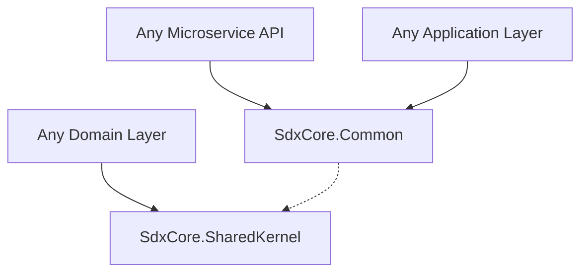

# SdxCore Building Blocks (Shared Libraries)

The `BuildingBlocks` directory contains shared class libraries and NuGet-style packages that are referenced across multiple microservices within the SdxCore ecosystem. By centralizing common code here, we ensure consistency, reduce code duplication, and enforce standardized patterns across all bounded contexts.

---

## 🏛️ Overall Architecture & Usage
The Building Blocks are entirely stateless. They are class libraries (`.dll`s) imported by the microservices at compile-time. They act as the glue and standardization engines for the ecosystem.

### Dependency Relationships
Microservices strictly reference specific building blocks based on their layer in the Clean Architecture:
- **Domain Layer** references `SdxCore.SharedKernel` (Core DDD components).
- **Application Layer** references `SdxCore.Common` (DTO Envelopes, Context Extraction).
- **API Layer** references `SdxCore.Common` (Middleware, Security Attributes).

---

## 📦 Projects Breakdown

### 1. `SdxCore.SharedKernel`
This library holds the core Domain-Driven Design (DDD) abstractions that define the foundation of the ecosystem. It has **zero external dependencies** outside of standard .NET libraries.
- **Base Entities**: Contains `BaseEntity`. Every domain entity (e.g., `Region`, `User`) inherits this to standardize the audit fields (`CreatedAt`, `CreatedBy`, `LastUpdatedAt`, `LastUpdatedBy`) and the soft-delete flag (`IsActive`).
- **Generic Repository Interfaces**: Contains `IRepository<TEntity, TKey>`. This ensures every microservice's persistence layer adheres to the exact same CRUD contract.
- **Domain Exceptions**: Base exception types (`DomainException`, `NotFoundException`) used to standardize error handling and HTTP status code mappings globally.

### 2. `SdxCore.Common`
This is the primary utility and standardization library used by the API and Application layers.
- **API Envelopes**: Contains the standard `ApiResponse<T>`, `PagedResponse<T>`, and `ErrorResponse` wrappers. Every controller in every microservice must wrap its response in one of these envelopes. This guarantees identical JSON structures for front-end consumers.
- **Context Management**: Houses the `IRequestContext` and `RequestContext` implementation. The `RequestContext` is registered as a Scoped service. It uses the `IHttpContextAccessor` to automatically extract the `X-User-Id` and `X-Roles` headers injected by the Gateway.
- **Security (`[GatewayOnly]`)**: Contains the `GatewayOnlyAttribute` authorization filter. This is applied to downstream controllers to ensure the `X-Internal-API-Key` is present, rejecting traffic that didn't proxy through YARP.
- **Dependency Injection Extensions**: Contains `ServiceCollectionExtensions` (e.g., `AddSdxCoreCommon()`) to cleanly register these shared services in a microservice's `Program.cs`.

### 3. `SdxCore.Contracts`
*(Reserved for future use)*
This project is dedicated to cross-service communication contracts, primarily for event-driven architecture.
- **Message Broker Contracts**: Will contain standard event models (e.g., `UserCreatedIntegrationEvent`, `RegionUpdatedIntegrationEvent`). By placing event models here, both the publisher (Identity Service) and subscriber (Time Service) can share the exact same C# class definition for RabbitMQ/Kafka serialization.

---

## 🏗️ Usage Guidelines & Rules

1. **No Domain Logic**: Building Blocks must **never** contain business logic specific to any microservice (e.g., no `BiometricDevice` or `User` logic here).
2. **Framework Agnostic (Mostly)**: Keep dependencies minimal. `SharedKernel` should have almost no external dependencies. `Common` may take dependencies on ASP.NET Core for middleware and context accessors.
3. **Immutability**: Shared logic must be highly robust and backwards compatible. Changing an interface in `SharedKernel` will force a recompile and refactor across the entire microservice ecosystem.
