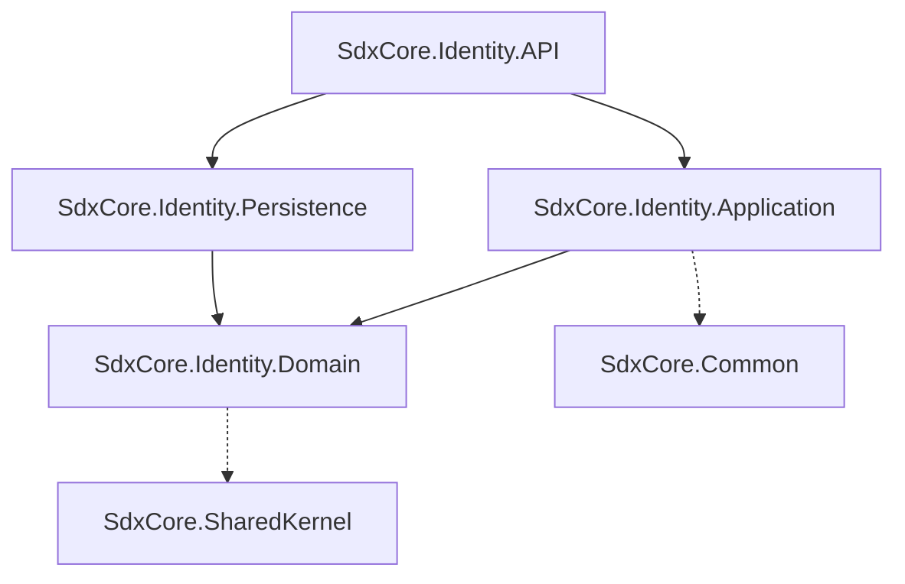

# SdxCore.Identity Microservice

The Identity microservice is the central authentication and authorization authority for the entire SdxCore ecosystem. It is responsible for verifying credentials, generating JSON Web Tokens (JWTs), and handling third-party integrations (SSO).

---

## 🏛️ Overall Microservice Architecture and Request Flow

The Identity service follows the strict 4-layer Clean Architecture. However, unlike downstream services, it has two distinct types of ingress traffic: public authentication requests and internal validation requests from the Gateway.

### The 4-Layer Clean Architecture
1. **API (`SdxCore.Identity.API`)**: The entry point exposing authentication endpoints (`/api/auth`).
2. **Application (`SdxCore.Identity.Application`)**: Houses the pluggable authentication providers (InHouse, SAML, OAuth), business logic, and DTO mapping.
3. **Domain (`SdxCore.Identity.Domain`)**: Defines core user entities, roles, security constraints, and repository interfaces.
4. **Persistence (`SdxCore.Identity.Persistence`)**: Entity Framework Core DbContext targeting the isolated `SdxCoreIdentity` database.

### Request Flow Example (User Login):
1. **Client** POSTs credentials to `https://<gateway>/api/auth/login`.
2. **Gateway** recognizes this as a public route and proxies it directly to the Identity API.
3. **Controller (`AuthController`)** receives the `LoginRequest` DTO and forwards it to the Application layer.
4. **Service (`IAuthenticationProvider`)**: The active authentication provider (e.g., `InHouseProvider`) verifies the password hash against the `UserRepository`.
5. **JWT Generation**: Upon success, a secure JWT is generated.
6. **Response**: A `TokenResponse` wrapped in an `ApiResponse<T>` is returned to the client.

**Request Flow Example (Token Validation - Internal):**
1. **Gateway** intercepts a request to a secure downstream service (e.g., `GET /api/v1/regions`).
2. **Gateway** sends an internal HTTP POST to `Identity.API`'s `/api/auth/validate-token` endpoint, passing the JWT and the internal `X-Internal-API-Key`.
3. **Identity API** validates the token signature, checks if the user is locked out or the token is revoked in the database.
4. **Identity API** returns a `TokenValidationResponse` containing the user's ID, Roles, and active status.
5. **Gateway** extracts these values, injects them as headers, and forwards the original request to the downstream service.

---

## 🔗 Dependency Relationships Between Layers

- **Domain**: Contains `User`, `Role`, `UserRole` entities and interfaces.
- **Application**: Contains multiple implementations of `IAuthenticationProvider` (InHouse, SAML, OAuth, OIDC, LDAP). Uses Strategy/Factory patterns to resolve the correct provider at runtime based on `appsettings.json`.
- **Persistence**: EF Core `DbContext` targeting the highly isolated `SdxCoreIdentity` database.
- **API**: Web host containing authentication controllers and JWT generation middleware.

---

## 📦 How DTOs are Mapped
- **Structure**: Located in `Domain/DTOs/Request/` and `Domain/DTOs/Response/`.
- **Mapping**: Since authentication requests are highly specialized (e.g., `LoginRequest`, `RegisterRequest`), DTO mapping is explicit within the Application layer.
- **Envelopes**: Like all SdxCore APIs, responses are strictly wrapped in `ApiResponse<T>` or `ErrorResponse`.

---

## 🗄️ How Repositories are Structured and Used
The Persistence layer leverages the generic **Repository Pattern**.
- **`IUserRepository`**: Extends `IRepository<User, int>`. Includes specialized methods for user-specific queries, such as `FindByUsernameAsync` or `UpdateFailedAttemptsAsync`.
- **Isolation**: Identity repositories **only** exist to manage credentials and security contexts. Business data (like User Profiles or Employee Data) belongs in separate HR or Profile microservices.

---

## 🔌 How Controllers are Mapped and Exposed
Controllers handle HTTP mapping for authentication flows:
- **Routing**: `api/auth/[action]`
- **Public Endpoints**: `/login`, `/register`, `/sso` are exposed to the public internet via the Gateway.
- **Internal Endpoints**: `/validate-token` is strictly protected. It demands the `X-Internal-API-Key` header, ensuring only the YARP Gateway can request token validation.

---

## 🤝 Inter-Service Communication Patterns
- **Ingress**: Receives public login requests and internal validation requests from the Gateway.
- **Egress**: Makes outbound HTTP requests to external Identity Providers (IdPs) when configured for SAML, OAuth, or OIDC.
- **Event Publishing**: (Future) Publishes `UserCreatedEvent` or `UserLockedOutEvent` to a message broker (RabbitMQ) so downstream services can update their local read-models if necessary.

---

## 💾 Database
Unlike downstream microservices, the Identity service maintains its own completely isolated database (`SdxCoreIdentity`). This ensures maximum security and prevents cross-contamination of highly sensitive credential data (like Argon2id password hashes) with regular business data.
