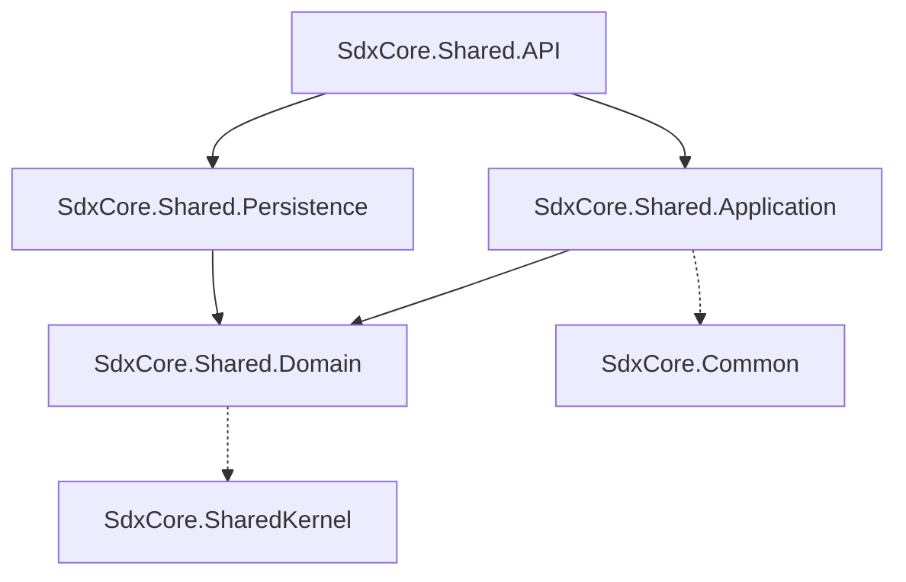

# SdxCore.Shared Microservice

The Shared microservice is a critical utility service within the SdxCore ecosystem. It acts as the centralized repository for static reference data and dynamic lookups, providing dropdown and menu items to front-end clients and other microservices.

---

## 🏛️ Overall Microservice Architecture and Request Flow

The service follows the strict 4-layer Clean Architecture. It isolates all global reference data into a single domain, ensuring data consistency across the ecosystem.

### The 4-Layer Clean Architecture
1. **API (`SdxCore.Shared.API`)**: Exposes the `/api/v1/lookups` endpoints. Protected by the `[GatewayOnly]` attribute to enforce proxy-level security.
2. **Application (`SdxCore.Shared.Application`)**: Contains the business logic, caching strategies, and abstraction layer for retrieving lookup lists.
3. **Domain (`SdxCore.Shared.Domain`)**: Defines the core `LookupItem` entity and repository interfaces. Has zero external dependencies.
4. **Persistence (`SdxCore.Shared.Persistence`)**: Houses the Entity Framework Core `DbContext` implementation and database querying logic.

### Request Flow Example (Get Country Lookups):
1. **Client** requests `GET /api/v1/lookups/COUNTRIES` with a Bearer Token.
2. **Gateway** intercepts the request, validates the token, and injects user context headers before proxying.
3. **Controller (`LookupsController`)** verifies the Gateway's internal API key via the `[GatewayOnly]` middleware.
4. **Service (`LookupService`)** processes the request, potentially checking a distributed cache (Future: Redis) before querying the database.
5. **Repository** fetches the `LookupItem` entities matching the `code`.
6. **DTO Mapping**: Entities are mapped (or directly returned if the entity is lightweight) and wrapped in an `ApiResponse<IEnumerable<LookupItem>>`.
7. **Response**: The payload flows back through the Gateway to the Client.

---

## 🔗 Dependency Relationships Between Layers

- **Domain**: Contains the `LookupItem` entity and `ILookupRepository` interface.
- **Application**: Contains the `LookupService` handling caching strategies and data retrieval logic.
- **Persistence**: EF Core `DbContext` connecting to the shared `SdxCore` database.
- **API**: The entry point exposing the endpoints, configured with dependency injection.

---

## 📦 How DTOs are Mapped
Because `LookupItem` is often a simple key-value pair (`Id`, `Code`, `Name`, `ParentId`), this service may bypass complex Request/Response DTO mapping for lightweight reads, returning the domain entity or a simplified `LookupResponse` directly to reduce overhead for highly accessed reference data.

---

## 🗄️ How Repositories are Structured and Used
- **Generic Repository**: Inherits from `BaseRepository<TEntity, TKey>` provided by the ecosystem.
- **Auditing**: Lookups are typically seeded by administrators. The generic repository still injects `CreatedAt` and `LastUpdatedAt` fields via the `IRequestContext` during insertions/updates.
- **Isolation**: Uses the generic repository pattern so the Application layer is strictly decoupled from Entity Framework Core.

---

## 🔌 How Controllers are Mapped and Exposed
Controllers are purely presentation gateways:
- **Routing**: `api/v1/lookups`
- **Security**: The `[GatewayOnly]` attribute is strictly enforced.

**Exposed Endpoints:**
- `GET /api/v1/lookups/{code}`: Fetches top-level lists (e.g., all states).
- `GET /api/v1/lookups/{code}/{parentId}`: Fetches hierarchical lists (e.g., states filtered by a specific country ID).

---

## 🤝 Inter-Service Communication Patterns
- **Ingress**: Responds to incoming HTTP GET requests proxied by the Gateway.
- **Egress**: The Shared service makes **zero** outbound HTTP calls to other services. It is an independent data provider.
- **State Changes**: If another microservice creates a new entity (e.g., Time service creates a new `Region`), it may eventually publish an event via RabbitMQ, which the Shared service could consume to invalidate its lookup cache.

---

## 💾 Database Normalization
By centralizing all reference data in a single microservice, we ensure that:
1. **Frontend Consistency**: UIs don't need to hardcode enums or dropdown arrays.
2. **Database Integrity**: Microservices reference standard identifier strings for lookups rather than scattered ENUM arrays.
3. **Cacheability**: Because lookup data rarely changes, this microservice is a prime candidate for edge caching (e.g., Redis).
