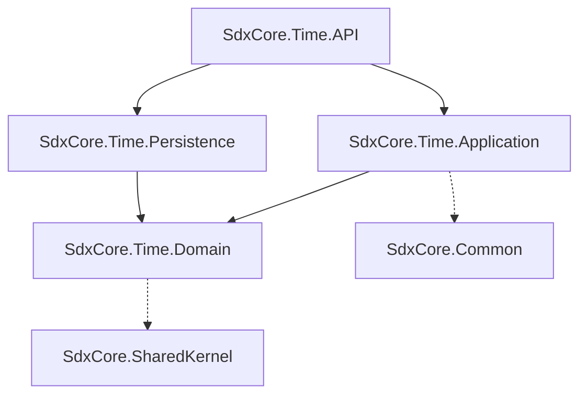

# SdxCore.Time Microservice

The Time microservice is a core downstream business service in the SdxCore ecosystem. It manages organizational structures, temporal tracking, and hardware integration endpoints (Biometric devices, Geofences).

---

## 🏛️ Overall Microservice Architecture and Request Flow

The service follows a strict 4-layer Clean Architecture. It is designed to be highly decoupled from the outside world, trusting the API Gateway to handle authentication and rate-limiting.

### The 4-Layer Clean Architecture
1. **API (`SdxCore.Time.API`)**: The presentation layer. It contains Web API controllers, dependency injection registration, and middleware. It is protected by the `[GatewayOnly]` attribute.
2. **Application (`SdxCore.Time.Application`)**: Contains business logic, Application Services, Validators, and DTO mapping.
3. **Domain (`SdxCore.Time.Domain`)**: Defines core Domain Entities (e.g., `Region`, `BiometricDevice`), Enums, Exceptions, and Repository Interfaces.
4. **Persistence (`SdxCore.Time.Persistence`)**: Houses the Entity Framework Core `DbContext` and implements the repository interfaces using the generic `BaseRepository`.

### Request Flow Example (Get Region Tree):
1. **Client** requests `GET /api/v1/regions/tree` with a Bearer Token.
2. **Gateway** intercepts, validates the token with the Identity service, and forwards the request to `Time.API` with `X-User-Id` headers.
3. **Controller (`RegionsController`)** receives the request. The `[GatewayOnly]` middleware validates it came from the Gateway.
4. **Service (`RegionService`)** is invoked. It handles business logic, executing tree-building algorithms.
5. **Repository (`RegionRepository`)** fetches raw entities from the `SdxCore` database using Entity Framework Core.
6. **DTO Mapping**: The raw `Region` entities are mapped to `RegionResponse` DTOs.
7. **Response Envelope**: The controller wraps the DTOs in an `ApiResponse<T>` and returns the payload to the Gateway, which forwards it to the client.

---

## 🔗 Dependency Relationships Between Layers



- **Domain**: Contains nothing but POCO entities (`Region`, `BiometricDevice`), Enums, Exceptions, and Repository Interfaces (`IRegionRepository`). It has **zero dependencies** on external frameworks.
- **Application**: Contains the business logic (`RegionService`). It relies on the Domain interfaces to fetch data and maps Domain entities to DTOs.
- **Persistence**: Implements the Domain repository interfaces using EF Core and SQL Server.
- **API**: The web host. It registers dependencies via `Program.cs` and handles HTTP routing. It references all other layers to bootstrap the application.

---

## 📦 How DTOs are Mapped

Data Transfer Objects (DTOs) are used strictly at the Application boundaries to prevent leaking Domain entities to the client.
- **Structure**: Located in `Domain/DTOs/Request/` and `Domain/DTOs/Response/`.
- **Naming Convention**: Always suffixed with `Request` (e.g., `CreateRegionRequest`) or `Response` (e.g., `RegionResponse`).
- **Mapping Process**: Mapping is currently handled via manual extension methods or lightweight mappers in the Application layer (e.g., `SimpleMapper.cs` or explicit `.Select(x => new RegionResponse { ... })`). This ensures full compile-time safety.

---

## 🗄️ How Repositories are Structured and Used

The Persistence layer utilizes the generic **Repository Pattern** to abstract database access.

1. **`IRepository<TEntity, TKey>`** (in `Domain/Interfaces/Repositories`): Defines standard operations (`GetByIdAsync`, `GetAllAsync`, `AddAsync`, `UpdateAsync`).
2. **`BaseRepository<TEntity, TKey>`** (in `Persistence/Repositories`): Implements the interface using EF Core.
   - **Automated Auditing**: During `AddAsync` and `UpdateAsync`, it automatically injects `CreatedAt`, `CreatedBy`, `LastUpdatedAt`, and `LastUpdatedBy` using the `IRequestContext` to pull the user ID from HTTP headers.
3. **Concrete Repositories**: E.g., `RegionRepository : BaseRepository<Region, short>, IRegionRepository`. Services inject `IRegionRepository` to execute specialized queries.

---

## 🔌 How Controllers are Mapped and Exposed

Controllers act purely as HTTP traffic cops. They contain **no business logic**.

- **Routing**: Standardized to `api/v1/[entities]` (e.g., `api/v1/regions`).
- **Gateway Constraints**: Every controller is decorated with `[GatewayOnly]`. This custom security filter rejects requests that lack the Gateway's internal secret key, preventing direct lateral attacks.
- **Envelopes**: Every endpoint returns an `ApiResponse<T>` or `PagedResponse<T>`.

**Example Controller Action:**
```csharp
[HttpGet("{id}")]
[ProducesResponseType(typeof(ApiResponse<RegionResponse>), StatusCodes.Status200OK)]
public async Task<IActionResult> GetById(short id, CancellationToken cancellationToken)
{
    var result = await _service.GetByIdAsync(id, cancellationToken);
    if (result == null) return NotFound(new ErrorResponse { ... });
    
    return Ok(new ApiResponse<RegionResponse>(result, "Successfully fetched Region."));
}
```

---

## 🤝 Inter-Service Communication Patterns

Currently, the Time microservice employs **Gateway-Facilitated Header Propagation**.
- **No Direct API Calls**: The Time service does not make direct HTTP calls to the Identity service or other downstream services.
- **Context Extraction**: The API Gateway validates tokens and injects standard `X-` headers (e.g., `X-User-Id`, `X-User-Roles`).
- **RequestContext**: The `SdxCore.Common.Contexts.RequestContext` singleton automatically extracts these headers from the ASP.NET `HttpContext` and makes them available globally to the Application and Persistence layers.
- **Future Expansion**: Cross-service state mutations will be handled via asynchronous message brokers (e.g., RabbitMQ) using contracts defined in `SdxCore.Contracts`.

---

## 💾 Database & Schema Isolation
The Time service does **not** have its own database. Instead, it shares the central `SdxCore` database but fully isolates its tables using the SQL Schema `[time]` (e.g., `[time].[Regions]`, `[time].[BiometricDevices]`).

## 🛡️ Global Soft Delete
Hard deletes (`DELETE` verb) are prohibited. All deletions are handled via `PATCH /api/v1/{entity}/{id}/status` which toggles the `IsActive` boolean flag, preserving historical integrity.
